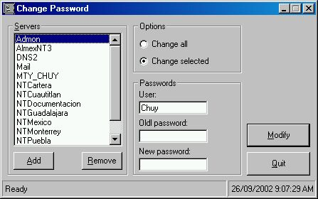

<div align="center">

## Change NT user password


</div>

### Description

This code change the any user password on NT4.0/2000/XP, of course, you need to have administrator permission on the server. You can change the password in only one server, or you can change the password on several servers in a list. This program was made with pure VB code, no Dll's, ActiveX, etc.

It take the local computer name (Default) and the current logged user.

Please vot for it, and give your feedback.
 
### More Info
 
\\Server_Name,"User","OldPassword",NewPassword"


<span>             |<span>
---                |---
**Submitted On**   |2002-09-26 08:57:26
**By**             |[Jesus Garcia](https://github.com/Planet-Source-Code/PSCIndex/blob/master/ByAuthor/jesus-garcia.md)
**Level**          |Advanced
**User Rating**    |5.0 (10 globes from 2 users)
**Compatibility**  |VB 5\.0, VB 6\.0
**Category**       |[Windows API Call/ Explanation](https://github.com/Planet-Source-Code/PSCIndex/blob/master/ByCategory/windows-api-call-explanation__1-39.md)
**World**          |[Visual Basic](https://github.com/Planet-Source-Code/PSCIndex/blob/master/ByWorld/visual-basic.md)
**Archive File**   |[Change\_NT\_1365859262002\.zip](https://github.com/Planet-Source-Code/jesus-garcia-change-nt-user-password__1-39285/archive/master.zip)

### API Declarations

```
Private Declare Function NetUserChangePassword Lib "Netapi32.dll" ( _
 ByVal domainname As String, ByVal Username As String, _
 ByVal OldPassword As String, ByVal NewPassword As String) As Long
```


